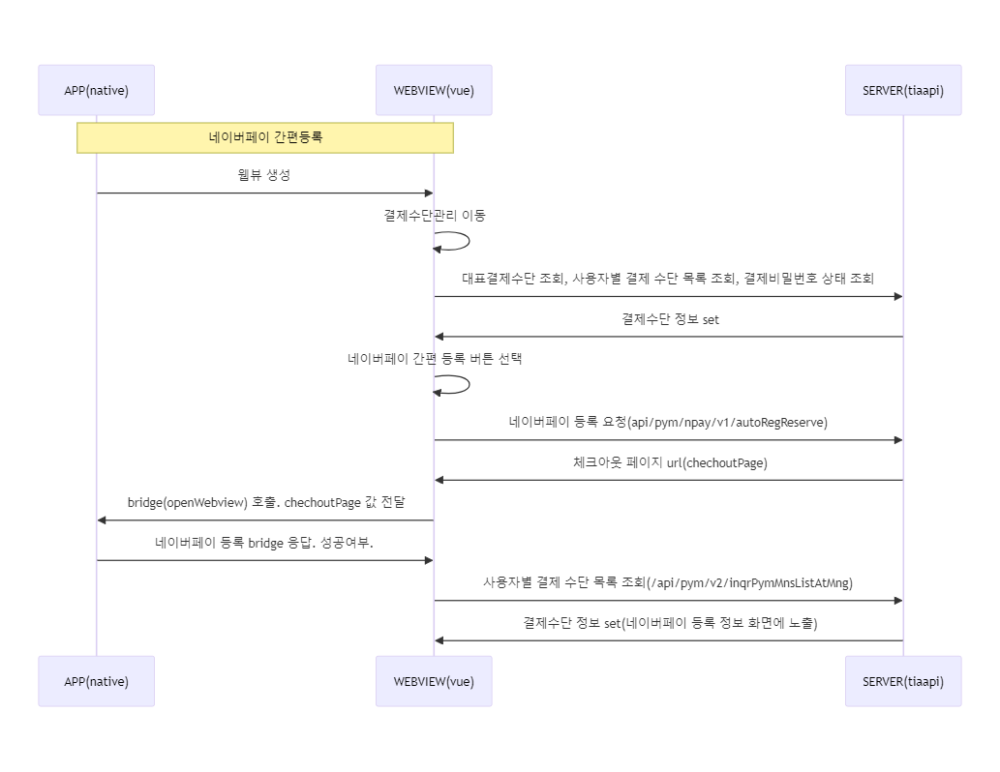

# 결제관련 프로세스

## 목차

TODO 티머니페이 호출 로직 정리 및 목차 정리
변경 / 추가 된 브릿지 아래 내용에 추가하기.

## 티머니페이 등록하기 인웹뷰 호출

티머니페이 등록하기 호출

**호출**

```json
  -- 앱설치시
  {
    "path" : "https://tiaapid.tmoney.co.kr:20318/webview/tmpy/reqAuth.do?appState=Y&authAppVer=?&authTpAppVer=?"
  }

  -- 앱미설치시
  {
    "path" : "https://tiaapid.tmoney.co.kr:20318/webview/tmpy/reqAuth.do?appState=N&authAppVer=?&authTpAppVer=?"
  }
```

**응답**

```json
{
  "response": {
    "code": "0000",
    "message": "티머니 등록 success"
  }
}
```

## 모바일티머니 가기

티머니페이가 기등록된 경우 노출되는
모바일티머니 가기 버튼 클릭시 티머니페이 어플 실행

**호출**

```json
{}
```

**응답**

```json
{
  "response": {
    "code": "0000",
    "message": "OK"
  }
}
```

## 모바일 비즈페이 등록하기 인웹뷰 호출

모바일 비즈페이 인웹뷰 호출

**호출**

```json
{
  "path": "https://tiaapid.tmoney.co.kr:20328/webview/pym/auth/v2/reqBzpyAuth.do"
}
```

**응답**

```json
{
  "response": {
    "code": "0000",
    "message": "OK",
    "data": {
      "pymMnsSno": "",
      "moappMbrsSno": "",
      "bzpyMemberid": "",
      "authVidDtm": "",
      "lmtAmt": "",
      "bzpyRstCd": "",
      "bzpyRstVal": ""
    }
  }
}
```

## 모바일 비즈페이 가기

비즈페이 이동 선택시 나오는 기능

**호출**

```json
{}
```

**실행요청**

```json
{
  "response": {
    "code": "0000",
    "message": "OK"
  }
}
```

## 네이버페이 간편등록/네이버페이 결제

네이버페이 등록/결제 프로세스. 브릿지(openWebview) 를 사용하여 네이버페이 등록/결제 처리
네이버페이, 토스페이 처리 동일. 호출 api만 다르다.



- 브릿지 예시

##### Request

```json
{ "url": "https://tiaapid.tmoney.co.kr:20328/webview/pym/auth/v2/reqBzpyAuth.do" }
```

##### Response

```json
{
  "response": {
    "code": "0000",
    "message": "OK"
  }
}
```

## 신용/체크카드 조회

고속,시외 항공 AppDatabase 관련 정보 요청\
TODO Flowchart 그리기\
조회 > 선택 > 결제

**호출**

```json
{}
```

**응답**

```json
{
  "response": {
    "code": "0000",
    "message": "OK",
    "data": {
      "smpcPymInfo": {
        "smpcPymList": [
          {
            "issuerCd": "LTC",
            "cardName": "롯데일반신용",
            "maskCardNo": "5137****1011",
            "paymentKey": "1010990000125409",
            "serviceGrpCd": "002",
            "checkCardYN": "N",
            "rprnCardYn": "N",
            "crpcId": "368",
            "path1": "/resources/images/ci/img_lottecard_logo_org.png",
            "path2": "/resources/images/ci/img_lottecard_logo_wh.png",
            "usePsbSvc": "BHCTXO"
          },
          {
            "issuerCd": "BCC",
            "cardName": "BC플래티늄신용",
            "maskCardNo": "4110****8165",
            "paymentKey": "1010990000125565",
            "serviceGrpCd": "002",
            "checkCardYN": "N",
            "rprnCardYn": "N",
            "cardAliasName": "test",
            "crpcId": "361",
            "path1": "/resources/images/ci/img_bccard_logo_org.png",
            "path2": "/resources/images/ci/img_bccard_logo_wh.png",
            "usePsbSvc": "BHCOTX"
          }
        ],
        "pblcPhrsTtlNm": ["[#1]사전등록 홍보문구", "[#2]사전등록 홍보문구"],
        "pblcPhrsCtt": ["[#1]사전등록 홍보문구", "[#2]사전등록홍보문구"],
        "displayYn": "Y",
        "pymMnsNM": "",
        "mbrsUseYn": "Y",
        "rprnPymMnsYn": "N",
        "pymMnsNm": null,
        "pymMnsId": "PRPM",
        "order": "5",
        "dataCount": "2",
        "pmsRgtDtm": "N"
      }
    }
  }
}
```

## 신용/체크카드 등록

고속,시외 항공 AppDatabase 데이터 입력\
TODO Flowchart\
OCR > 등록 ~~ 하위에 삭제프로세스 까지.

**호출**

```json
{
  "issuerCd": "LTC",
  "cardName": "롯데일반신용",
  "maskCardNo": "5137****1011",
  "paymentKey": "1010990000125409",
  "serviceGrpCd": "002",
  "checkCardYN": "N",
  "rprnCardYn": "N",
  "crpcId": "368",
  "path1": "/resources/images/ci/img_lottecard_logo_org.png",
  "path2": "/resources/images/ci/img_lottecard_logo_wh.png",
  "usePsbSvc": "BHCTXO"
}
```

**응답**

```json
{
  "response": {
    "code": "0000",
    "message": "OK",
    "data": {
      "rspCd": "0000",
      "rspMsg": "등록 완료",
      "paymentKey": "1010990000125409"
    }
  }
}
```

## 보안키패드

TODO Flowchart

1. 보안키패드 호출 > response
2. 보안키패드 input call 호출 > native web 브릿지 호출 (여러번) > response
